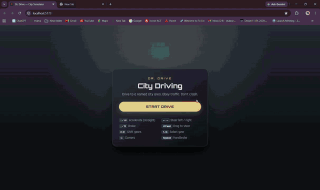

# JevDrive

City driving automation simulator where **Jev (Codiv / OpenJEV)** is the navigator — not a scripted bot.

Switch to **AUTO** and the car drives itself: turn direction, pace (`go` / `crawl` / `fast`), automatic gear shifts (1–5), stop at reds, yield at zebras, and routing toward named city destinations (**Market**, **Station**, and more).

## Demo

<!-- Full ~1:40 AUTO recording — GIF autoplays inline on GitHub (no click / no download) -->
<p align="center">
  
</p>

**Full demo (~1:40)** — also as MP4: [`docs/demo.mp4`](https://github.com/durgaramakrishnakapa/JevDrive/raw/main/docs/demo.mp4)

<video src="https://github.com/durgaramakrishnakapa/JevDrive/raw/main/docs/demo.mp4" width="100%" controls muted playsinline>
</video>

> AUTO on · Jev brain live on the HUD · full ~1:40 drive

## What this explores

Autonomous navigation under **real Jev / LLM latency**:

| Piece | Detail |
| --- | --- |
| Model | Codiv System One · primary **`laya-1.0`** (fallback **`openjev-0.1`**) |
| Cadence | **~3 requests/sec** (one ask every **0.3 s**) |
| Keys | **10 Codiv API keys** in rotation — each call uses the next key |
| Latency | Typical RTT **~1.5–3 s** (sometimes **2–4 s** on the HUD) |

Gear, speed, direction, and traffic rules — while the model is still thinking.

## Stack

- **Frontend / sim:** Vite + TypeScript + Three.js
- **Automation server:** FastAPI (`Automation/`) on `127.0.0.1:8787`
- **Brain:** Codiv System One (`laya-1.0`)

## Quick start

### 1. Game (Vite)

```bash
npm install
npm run dev
```

Open the local URL Vite prints (usually `http://localhost:5173`).

### 2. Jev automation server

```bash
cd Automation
python -m venv venv
# Windows:
.\venv\Scripts\activate
pip install -r requirements.txt
copy .env.example .env
# put your Codiv keys in .env (never commit .env)
uvicorn server:app --host 127.0.0.1 --port 8787 --reload
```

Or from the repo root (Windows, after venv exists):

```bash
npm run auto:server
```

### 3. Drive

1. Click **START DRIVE**
2. Switch **AUTO**
3. Watch **JEV BRAIN** — **ASK** (what Jev answered) vs **CAR NOW** (what the car is following)

## Repo layout

```
jev_drive/
  src/game/          # city, traffic, pedestrians, AutoDriver, HUD
  Automation/        # FastAPI + Jev / Codiv client
  docs/demo.mp4      # AUTO mode recording
  index.html
```

## Notes

- `Automation/.env` is gitignored — use `.env.example` as a template.
- Named destinations prefer **Market** and **Railway Station** more often; hospital is never the mission goal.


